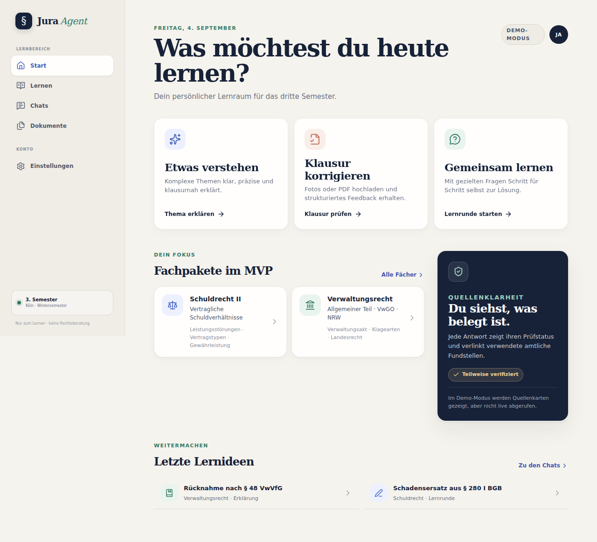
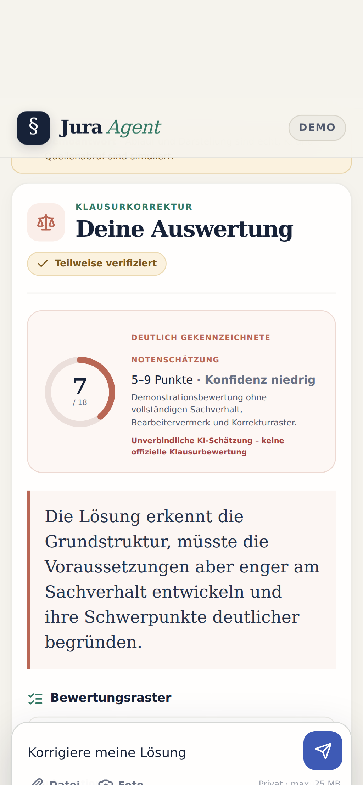

# Jura Agent

Mobile-first Lernassistent für das deutsche Jurastudium. Der MVP unterstützt Erklärungen, sokratisches Lernen und Klausurkorrekturen mit klar gekennzeichneter Notenschätzung. Amtliche Quellen werden über eine interne Provider-Schicht eingebunden.

> **Wichtig:** Jura Agent ist ein Lernwerkzeug und keine Rechtsberatung. Antworten und Notenschätzungen müssen fachlich geprüft werden.

## MVP

- drei Lernmodi: **Verstehen**, **Klausur korrigieren**, **Gemeinsam lernen**
- Schwerpunktpakete Schuldrecht II / vertragliche Schuldverhältnisse und Allgemeines Verwaltungsrecht / VwGO / NRW
- kontrollierte amtliche Recherche: NeuRIS, Gesetze-im-Internet und RECHT.NRW
- Foto-, PDF- und Text-Upload mit mobilen Kamera-Inputs
- strukturierte OpenAI-Antworten, Quellenvalidierung und Kostenbremse
- klassischer Chatverlauf mit sichtbaren Rückfragen und serverseitigem Kontext aus den letzten vier Dialogrunden
- Modellwahl pro Chatlauf: sparsam/normal mit Luna, stärker mit Terra, stark mit Sol
- genau zwei lokale Konten mit getrennten Lernverläufen und Dokumenten
- SQLite und Uploads in einem persistenten Docker-Volume – ohne externen Datenbankdienst
- transparenter Demo-Modus ohne geheime Schlüssel

## Lokal starten

```bash
cp .env.example .env.local
npm install
npm run dev
```

Voraussetzung ist Node.js 24. Die Voreinstellung startet den klar markierten Demo-Modus. `.env.example` enthält nur leere Platzhalter und darf keine echten Schlüssel erhalten, wenn es committed wird.

Für einen lokalen Live-Test `DEMO_MODE=false`, `DATA_DIR=.data`, einen mindestens 32 Zeichen langen `SETUP_TOKEN`, `APP_URL` und den `OPENAI_API_KEY` in einer ignorierten `.env.local` setzen. Danach `/setup` öffnen und genau zwei Konten anlegen.

## Prüfen

```bash
npm run check
npm run test:storage-smoke
npx playwright install chromium
npm run test:e2e
```

## Portainer

Der App-Container lauscht intern auf **Port 3000** und veröffentlicht bewusst keinen Host-Port. Im gemeinsamen externen Docker-Netzwerk `web-services` lautet das Cloudflare-Ziel:

```text
http://jura-agent:3000
```

Portainer baut die einzige `docker-compose.yml` direkt aus dem Repository. Echte Werte werden ausschließlich als Stack-Variablen in Portainer gesetzt. Das Compose-Setup legt das persistente Volume `jura-agent-data` für Datenbank und Uploads an.

Nach dem ersten Deployment:

1. `https://DEINE-DOMAIN/setup` öffnen und mit dem `SETUP_TOKEN` beide Konten anlegen.
2. `SETUP_TOKEN` anschließend aus Portainer entfernen und den Stack neu deployen.
3. Das Volume `jura-agent-data` regelmäßig sichern; ein Redeploy darf es nicht löschen.

Weitere Details stehen in [docs/ARCHITECTURE.md](docs/ARCHITECTURE.md), [docs/OPERATIONS.md](docs/OPERATIONS.md) und [docs/PORTAINER.md](docs/PORTAINER.md).

## Vorschau




