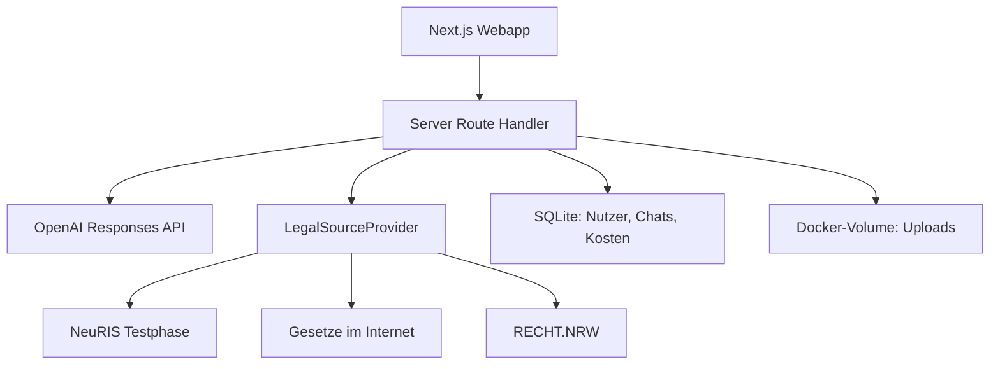

# Architektur

## Zielbild

Jura Agent ist eine mobile-first Next.js-Webapp für genau zwei lokale Konten. Der MVP bleibt bewusst monolithisch: UI, serverseitige Route Handler, Authentifizierung, SQLite-Zugriff und Provider-Schichten laufen in einem Node.js-Container. Ein benanntes Docker-Volume hält Datenbank und Originaldateien persistent.

## Vertrauensgrenzen

- Browser erhalten niemals `OPENAI_API_KEY` oder `SETUP_TOKEN` aus der Serverumgebung.
- Die einmalige Setup-Transaktion akzeptiert exakt zwei unterschiedliche E-Mail-Adressen. Danach sind weitere Registrierungen gesperrt.
- Passwörter werden mit scrypt, zufälligem Salt und festen Kostenparametern gehasht. Sitzungen verwenden zufällige Tokens; in SQLite liegt nur deren SHA-256-Hash.
- Session-Cookies sind `HttpOnly`, `SameSite=Lax` und im HTTPS-Betrieb `Secure`. Mutierende Route Handler prüfen zusätzlich die Herkunft.
- Jede persönliche SQL-Abfrage enthält die serverseitig ermittelte Nutzer-ID. Dokumentpfade werden gegen Verzeichnisausbruch validiert.
- Dokumente liegen mit restriktiven Dateirechten unter einem Nutzerpräfix im `/data`-Volume.
- Inhalte aus Uploads gelten als untrusted input und können keine Systemanweisungen überschreiben.
- Modellzitate sind nur gültig, wenn ihre IDs aus dem tatsächlichen Provider-Ergebnis stammen.

## Antwortfluss

1. Anfrage und Anhang-Referenzen werden mit Zod validiert. Bei echten Konten lädt der Server OCR-Text, Lesbarkeit und Dokumentmetadaten ausschließlich anhand nutzereigener Dokument-IDs aus SQLite; Browsertext wird nicht als Beleg übernommen.
2. Die Kostenbremse prüft den gemeinsamen Monatsverbrauch.
3. Bei einer Folgefrage werden die letzten acht Nachrichten des eigenen Chats serverseitig geladen. Der Browser kann keinen fremden Verlauf einschleusen.
4. Bei Klausurkorrekturen werden die aus den Unterlagen extrahierten Normverweise in die amtliche Recherche übernommen. Dadurch sucht NeuRIS nach den tatsächlich geprüften Vorschriften statt nach einem generischen Korrekturauftrag.
5. Jede juristische Lernfrage löst eine kontrollierte amtliche Recherche aus; natürliche Fragen werden dafür in fokussierte Suchbegriffe zerlegt. Der interne Provider bildet den NeuRIS-Ablauf aus Suche und amtlichen Dokumenttreffern nach, ohne dem Modell freien Netzwerkzugriff zu geben.
6. Der Composite Provider fragt höchstens drei externe Quellenwege ab und gibt strukturierte Quellenobjekte zurück. Bei Korrekturen werden bis zu drei konkrete NeuRIS-Treffer zusätzlich über ihren Dokument-Endpunkt vertieft; bei 403 oder fehlendem Detailtext bleibt der Suchauszug erhalten.
7. Fach-, Methoden- und Modus-Skills werden deterministisch aus `skills/*.md` aufgelöst. Der Korrektur-Skill erzwingt Materialtrennung, interne Referenzlösung, Soll-Ist-Vergleich und eine dokumentierte Bewertungsbasis.
8. OpenAI erhält den begrenzten Chatkontext und bis zu 180.000 Zeichen klar markierter, nicht vertrauenswürdiger Dokumente. Es liefert über Structured Outputs genau eines der drei Schemas. `store: false` verhindert API-seitige Response-Speicherung.
9. Der Citation Validator verwirft nicht belegte Quellen-IDs. Eine reine studentische Bearbeitung zählt nicht als stützende Kursunterlage.
10. Nutzerfrage, Antwort, Tokenverbrauch und Kosten werden gespeichert und im vollständigen Chatverlauf angezeigt.

## Lokale Datenhaltung

SQLite läuft im WAL-Modus mit aktivierten Fremdschlüsseln, striktem Schema und einer expliziten Schema-Version. Schema-Version 2 ergänzt Dokumentrolle, Lesbarkeit und OCR-Warnungen; die Migration erhält bestehende Datensätze. Das passt zu einem privaten Ein-Container-Betrieb und vermeidet einen kostenpflichtigen externen Dienst. Mehrere parallel schreibende App-Replikate oder ein gemeinsam verwendetes Netzwerk-Dateisystem sind für diesen MVP nicht vorgesehen.

Das Volume schützt nicht vor einem Administrator des Docker-Hosts. Für sensible Dokumente gehören daher Host-Verschlüsselung, restriktiver Portainer-Zugriff und verschlüsselte Backups zum Betriebsmodell.

## Quellenstatus

| Status | Bedeutung |
|---|---|
| Amtlich verifiziert | Alle verwendeten Rechtsquellen wurden in diesem Lauf amtlich abgerufen. |
| Mit Kursunterlage belegt | Aussage stützt sich auf eine Lösungsskizze, einen Bewertungsbogen oder ein Skript, nicht auf eine amtliche Aktualitätsprüfung. Eine reine studentische Bearbeitung genügt dafür nicht. |
| Teilweise verifiziert | Nur ein Teil der rechtlichen Grundlage wurde amtlich bestätigt. |
| Nicht aktuell verifiziert | Keine aktuelle amtliche Quelle konnte bestätigt werden. |

NeuRIS befindet sich in einer Testphase und kann Lücken haben. Deshalb bleiben [Gesetze im Internet](https://www.gesetze-im-internet.de/) und [RECHT.NRW](https://recht.nrw.de/) kontrollierte Fallbacks.
