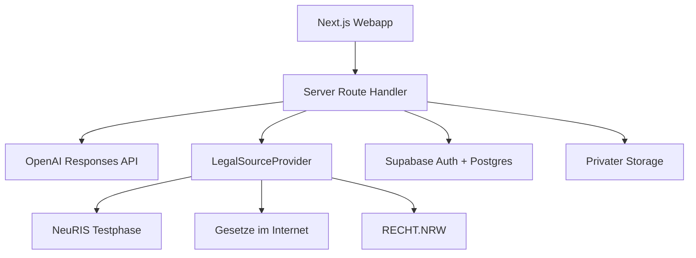

# Architektur

## Zielbild

Jura Agent ist eine mobile-first Next.js-Webapp für genau zwei freigeschaltete Konten. Der MVP bleibt bewusst monolithisch: UI, serverseitige Route Handler und Provider-Schichten werden gemeinsam auf Vercel betrieben; Supabase übernimmt Authentifizierung, PostgreSQL und privaten Objektspeicher.

## Vertrauensgrenzen

- Browser erhalten niemals `OPENAI_API_KEY` oder `SUPABASE_SERVICE_ROLE_KEY`.
- Produktionsrouten verlangen einen gültigen Supabase-Nutzer und prüfen zusätzlich die exakt zwei Adressen aus `ALLOWED_EMAILS`.
- Row Level Security bindet alle persönlichen Zeilen an `auth.uid()`.
- Dokumente liegen im privaten Bucket unter einem Nutzerpräfix.
- Inhalte aus Uploads gelten als untrusted input und können keine Systemanweisungen überschreiben.
- Modellzitate sind nur gültig, wenn ihre IDs aus dem tatsächlichen Provider-Ergebnis stammen.

## Antwortfluss

1. Anfrage und Anhänge werden mit Zod validiert.
2. Die Kostenbremse prüft den gemeinsamen Monatsverbrauch.
3. Die Retrieval-Entscheidung verlangt amtliche Recherche bei konkreten Normen, Aktualitätsfragen, Rechtsprechung und jeder Korrektur.
4. Der Composite Provider fragt höchstens drei externe Quellenwege ab und gibt strukturierte Quellenobjekte zurück.
5. Fach-, Methoden- und Modus-Skills werden deterministisch aus `skills/*.md` aufgelöst.
6. OpenAI liefert über Structured Outputs genau eines der drei Schemas. `store: false` verhindert API-seitige Response-Speicherung.
7. Der Citation Validator verwirft nicht belegte Quellen-IDs.
8. Antwort, Tokenverbrauch und Kosten werden gespeichert.

## Quellenstatus

| Status | Bedeutung |
|---|---|
| Amtlich verifiziert | Alle verwendeten Rechtsquellen wurden in diesem Lauf amtlich abgerufen. |
| Mit Kursunterlage belegt | Aussage stützt sich auf einen Upload, nicht auf eine amtliche Aktualitätsprüfung. |
| Teilweise verifiziert | Nur ein Teil der rechtlichen Grundlage wurde amtlich bestätigt. |
| Nicht aktuell verifiziert | Keine aktuelle amtliche Quelle konnte bestätigt werden. |

NeuRIS befindet sich in einer Testphase und kann Lücken haben. Deshalb bleiben [Gesetze im Internet](https://www.gesetze-im-internet.de/) und [RECHT.NRW](https://recht.nrw.de/) kontrollierte Fallbacks.
